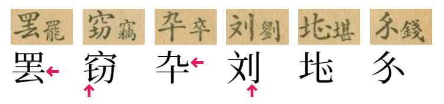
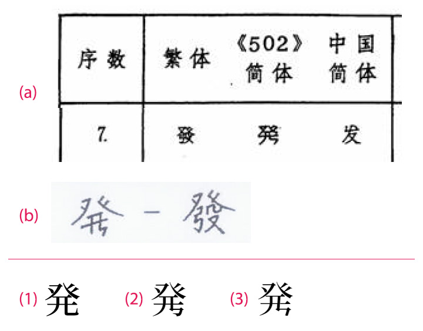
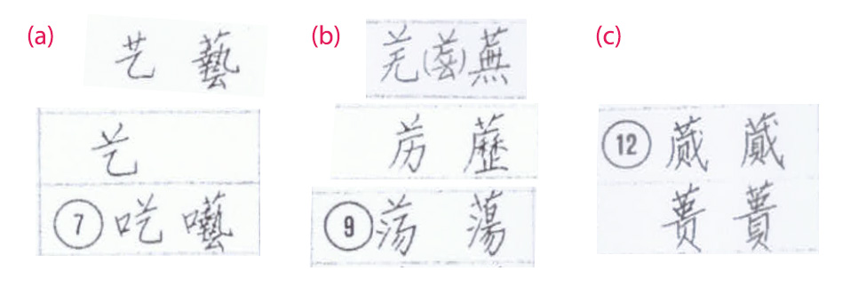

# 邪宋 EvilSung

邪宋是蒐集各政權曾制定的各種簡體方案，容易切換顯示的字型。

本字型以 Big5 繁體字為字頭，並以 OpenType 的 ssXX 特性切換到對應的簡體方案。
收錄的方案包括國民政府、中國、新加坡曾制定的各種方案。
因只處理中文，所以先不考慮收錄日本新字體。（不知道是否存在太平天國簡體字的公文？）

## 收錄的簡體方案一覽

| 特性 | 年份 | 政府 | 方案 | 備註 |
|-|-|-|-|-|
|ss01|1935|國民政府|〈第一批简体字表〉|僅數月就廢止|
|ss02|1954|中國|〈漢字簡化方案草案〉|一併處理798簡體字與400擬廢除異體，不處理手寫簡化偏旁|
|ss03|1956|中國|〈漢字簡化方案〉(第一批)|共分四批推行，一併套用〈第一批异体字整理表〉內容|
|ss04|1956|中國|〈漢字簡化方案〉(第二批)|同上|
|ss05|1958|中國|〈漢字簡化方案〉(第三批)|同上|
|ss06|1959|中國|〈漢字簡化方案〉(第四批)|同上|
|ss07|1964|中國|〈简化字总表〉|配合〈第一批异体字整理表〉|
|ss08|1965|中國|〈印刷通用汉字字形表〉|自此套用新字形|
|ss09|1969|新加坡|〈簡體字表〉|或稱502簡體|
|ss10|1974|新加坡|〈简体字总表〉|宣布採用中國簡化字，但容許已公布之502簡體一起使用|
|ss11|1977|中國|〈第二次汉字简化方案（草案）〉第一表|已在刊物試用|
|ss12|1977|中國|〈第二次汉字简化方案（草案）〉第二表|實際施行情況不明|
|ss13|1986|中國|〈简化字总表〉|二簡宣告放棄，回歸1964年規定，但有若干不同|
|ss14|1988|中國|〈现代汉语通用字表〉|主要是恢復原合併的異體字|
|ss15|2013|中國|〈通用规范汉字表〉|主要是恢復原合併的異體字|

## 技術限制

邪宋盡可能支援 Unicode 最新版本。
各種已廢除的簡體字，凡是在 Unicode 內已經編碼的，都盡量指定有正確的 Unicode 值。

例如「微」的二簡是「𡵉 (U+21D49)」。因為 Unicode 已編碼，所以不只可以在「微」字的 ss10 特性，直接輸入「𡵉」字亦可顯示。

意即，邪宋不只是個可打繁出簡（需要 OpenType 特性切換）的字型，也可以直接輸入簡體字。
但沒有任何 OpenType 特性切換時，未簡化的字會多數會偏舊字形寫法。

Unicode 未收錄的字符，則無法直接輸入。
但 Unicode 收字眾多，我可能有所遺漏，若發現遺漏，煩請在 issues 告知。

另外，雖然邪宋的主體是以 Big5 為字頭去轉簡體，
但由於中國二簡屬於簡化字的再簡化，所以**所有的簡化字也都支援作為字頭切換至二簡**。

但邪宋無法支援各種簡化字轉換至繁體。

簡體字就其特性，各國不同方案衝突不少。如國民政府簡體字的「广」是「庵」的簡體字，在中國簡體字則是「廣」的簡體字。
實務上難以支援簡體字之間互轉的功能。

## 製作限制

由於本專案純屬業餘興趣製作，並非嚴謹學術研究，目的是輕鬆檢視各方案的簡化字樣。
比較關注的點在於胎死腹中的各方案，而對現行有效的各表只是對照性的收錄，應該充滿許多遺漏。

且因易用性與技術上的限制，字頭以 Big5 常用的繁體字為準。
故各方案中所列之繁體字、被整理之異體字多有艱深難懂之字，本字型可能就跳過不處理。
另外像「併」「倂」這類差異，無論當初在各字表以簡體字、異體字還是舊字形看待，由於實際上現行台灣常用字即為「併」字，Big5 亦未收錄「倂」字，此字型目前就傾向不處理。

為了呈現 1965〈印刷通用汉字字形表〉後印刷字體的變化情形，本字型故意採用思源宋體的 KR 版本作為繁體字的字形來表達出變化。
不過繁體字並非本字型重點處理部分，故此對應乃單純機械處理（直接程式比對思源宋體中 KR 與 CN 的差異），並非嚴謹的逐字審定。
例如 KR 習慣上也不用舟月，而是月。
又因 Unicdoe 統合或分離的關係，像是「真」等漢字在繁體字也只能以簡體字樣呈現。

早年的簡體字方案多為手寫稿，即使是鉛字印刷稿，嚴謹的字形楷化與否亦並不穩定。
例如國民政府〈第一批简体字表〉是手寫小楷，宋體化以後到底該做成舊字形字樣或新字形，就是個為難的問題。又如早年的 1964〈简化字总表〉，又可看到很多應是一筆畫處，鉛字雕刻成斷筆形式。
鉛字的改刻需要時間的累積，我相信 1965〈印刷通用汉字字形表〉之前，其實隨著各印廠改刻的進度不同，可能就有若干字逐漸轉換成新字形了。
又如〈漢字簡化方案〉所規定的偏旁類推簡化，也因改刻成本問題，方案中的印樣尚未簡化。
網路資料說隨第四批開始推行，但相信實際上各廠印刷情況應有相當的前後時間差。

因要實際呈現這些切換時間點，實在難以調查。
本字型選擇一刀切，偏旁類推簡化的部分，一律在 1964〈简化字总表〉起適用。
而舊字形與新字形的切換則一律放在〈印刷通用汉字字形表〉之後。

但簡體字本身（除非Big5有收）原則上都用新字形製作為主（除非只出現於1954〈漢字簡化方案草案〉），故〈印刷通用汉字字形表〉之前可能會有新舊字形夾雜的情形。

## 關於中華民國（中國大陸時期）的簡體字

〈第一批简体字表〉為書法小楷形式，部分文字鉤與不鉤，連筆與斷筆，其實難以認定。

如圖中竊字左下難以識別是「七」還是「土」旁，先以中國簡化字視為同一字形。
卒字上方的「九」，也比照字型內其他的「九」一樣鉤起。
有些字形完全是書寫體，未曾見過宋體印樣（如堪、錢字），實在不知道怎麼樣是比較合理的宋體。我盡力了……。

## 關於新加坡的簡體字

之前看到文件，新加坡的「發」字簡體怎麼會這麼奇怪（如下圖 a）。

網路上實在找不到更多新加坡簡體相關資料，剛好我 2019 年路過新加坡有半天空檔，於是乾脆去一趟新加坡國家圖書館借出三份簡體字表元件，這才解開所有謎團。

新加坡 1969 的〈簡體字表〉、1974 的〈简体字总表〉都是手寫（下圖 b），實在夾雜太多書寫者的習慣。
手寫簡筆字時，最後一筆寫成這樣其實是蠻常見的情形。像「寫」的台灣簡筆字末筆，也是有這種ㄣ狀的造形。

問題就在它的宋體該長什麼形狀。
有人認為可以把它視為與日本新字體「発」為同一字形（下圖1），而新加坡自己的研究資料就如圖 a 般製作成奇特的明體。
在邪宋 2019 版本，設計成下圖(2)般勾起的造型。
2022 改版時，取消勾起，改為(3)的造型。較類似(a)的，但試著處理較能還原字稿筆形。

1974 的〈简体字总表〉整批引入中國 1964 的〈简化字总表〉，但這本也是手寫的，而且比 1969 那本寫得更潦草而不工整，故也留下很多字形上的困擾。

尤其是草字頭的處理，此表中許多簡繁對照的字樣，繁體字是完整四筆的草頭，但簡體字卻變成了「䒑」，看似屬於簡化的一部分（如 b）。但部分文字又照樣寫成三筆草頭（如 c），甚至部分文字還有出現在不同表中草頭寫法不一致的問題（如 a）。

由於草頭並未出現在表二的可類推偏旁裡，在此只將草頭視為書寫者個人習慣（但有部分少數幾個文字造好玩的XD）。

1974 的〈简体字总表〉原則上是已經決定使用中國〈简化字总表〉，但保留與502簡體字形不同的簡體字，作為可接受的異體，兩者皆可。

邪宋的處理是，優先繼承所有502簡體後，再把其他未簡化的字都適用 1964〈简化字总表〉機械式處理。未實際與此表逐字比對。

另，新加坡於 1976 又公布〈简体字总表修订本〉，完全廢止了原502簡體，一律比照中國簡化字，故邪宋就不特別製作了。

## 關於中國的簡化字

### 整理問題

中國是簡化方案階段最多的政權，也是整理起來最複雜的。

例如有些我們認為的簡化字，其實不在〈简化字总表〉裡，可能被認為是異體字關係。
如〈第一批异体字整理表〉所收的「杰（傑）」。

有些字也有些矛盾，例如 1955年〈第一批异体字整理表〉規定「墻」是異體字，整併為「牆」。
但 1964 年〈简化字总表〉裡刊登「墙」的對應繁體字卻是「墻」不是「牆」。
像這種字，本專案在機械性處理時，先把「墻」根據〈异体字表〉轉換成「牆」以後，就無法再根據〈简化字总表〉轉換成「墙」，故對照表後面又加上很多人工修改資料。

加上 Unicode 來源分離的關係，有些字變得更複雜。
像〈简化字总表〉裡定義「录」的繁體字是「録」（不是「錄」）。
「録」與「錄」不在〈第一批异体字整理表〉裡，甚至不是異體字關係，只是印刷字形差異。
但〈印刷通用汉字字形表〉是隔年 1965 年才發布，偏偏 Unicode 又分離了這兩個字，為了在〈简化字总表〉能正常處理這個轉換，只好也另外加進對照表裡。

像這種並非繁簡關係也並非異體字關係的字，其實整理起來最麻煩的。
例如「炖（燉）」字原出現在〈第二次汉字简化方案（草案）〉第一表中，當時定義是簡繁關係。後來二簡廢除後，亦未出現在 1984 年重新發布的〈简化字总表〉裡。
但在〈现代汉语通用字表〉卻出現了「炖」字，在 2013 年〈通用规范汉字表〉中，甚至收錄了「炖」字，並且沒有列出任何對應繁體字或異體字（這兩表都沒有收「燉」字）。
也就是說，在現行規範中，「炖」就是「炖」。它不是簡體字，「燉」字從不存在！
當然以邪宋來說，是沒辦法這樣處理的。所以就讓它從二簡之後一直保持簡繁對應關係，將「燉」轉換成「炖」。

### 類推簡化問題

類推簡化也是個整理上的困擾。

邪宋 2019 版本是用 GB2312 與 GB12345 直接對照，找出所有簡繁差異。
但 2022 年重新整理時，發現其中許多類推簡化字完全沒出現在各版本字表中。

雖然依照「類推簡化」的概念，既然偏旁規定了類推簡化，這些字確實也已經收錄在電腦字集裡，就直接把這些字當作簡化字處理並沒有問題。
但這一版本為了較正確呈現兩版〈简化字总表〉，以及後續與〈现代汉语通用字表〉、〈通用规范汉字表〉的差別，嘗試盡可能將類推簡化字限縮在表內範圍。

但因為我實在找不到 1955 年〈印刷通用汉字字形表〉的全文（而且也難以人工整理整本紙本文件），所以暫時作以下的處置：

1. 舊版裡曾出現的簡化字，不在〈通用规范汉字表〉的，就不予簡化。
但有出現在之前〈简化字总表〉、〈现代汉语通用字表〉各表中者，則依照恢復繁體處理，只在特定時期簡化。
2. 不見於〈现代汉语通用字表〉，而出現在〈通用规范汉字表〉者，則視為 2013 年的新增簡化字。更之前都不簡化。
3. 未出現於兩份〈简化字总表〉，但在〈现代汉语通用字表〉與〈通用规范汉字表〉都能找到者，都假設為 1964 年〈简化字总表〉時就已經類推簡化。

### 複數對應問題

很多簡化字、或部份恢復使用的異體字，是有條件限制的。

例如「乾」字念ㄍㄢ時簡化為「干」，ㄑㄧㄢˊ則仍寫成「乾」。
又如「锺（钟）」、「昇（升）」等字，都是部分恢復，只有作人名使用時可不簡化。

也就是乾的簡化字有可能是「乾」或「干」；鍾的簡體字可能是「锺」或「钟」。
像這種一對多關係是字型所難以處理的。

邪宋只是個興趣本位方便對照簡體的小工具，並非嚴格的轉換工具，不太想花太多成本處理這些問題。
所以要轉換成哪一個，多數憑個人直覺選擇一個比較常用的情形作轉換。

同樣的情況也在二簡裡，像二簡第二表裡以詞彙的形式規定「叮嚀」簡寫成「丁宁」。
但沒有說「叮」簡化成「丁」，「嚀」簡化成「宁」。
以詞彙為單位處理簡化對應在技術上不是不可能，但為了簡化問題，邪宋也只是單純處理用途較限定的文字，例如前例，會將「嚀」對應到「宁」，但「叮」字較常有其他用途，就不對應到「丁」。
所以部份簡化詞組可能無法得到完全正確的簡化轉換。

### 各種草案的選擇

在中國眾多簡化方案中，有些是正式實施，有些名為草案。
但就算是草案，也都在報章雜誌經過相當程度的各種的試行，故每個方案都有一定世代的學生使用過。
而且所有草案都已製成印刷字體刊印，所以應該都適合邪宋整理出來。

但邪宋在製作上，作了一定程度的選擇：

#### 〈漢字簡化方案草案〉

〈漢字簡化方案草案〉由「798個漢字簡化表草案」、「擬廢除的400的異體字表草案」、「漢字偏旁手寫簡化表草案」三份文件所構成。

其中「漢字偏旁手寫簡化表草案」當初是規定成手寫時可接受的型式（類似英文書寫體的概念），並沒有要實施在印刷文字上。所以邪宋不處理此表格。

另外「擬廢除的400的異體字表草案」內整理掉的許多異體字生僻難用，平常現代繁體中文使用的就是其保留字者，在此就跳過不建檔。

### 〈漢字簡化方案〉

〈漢字簡化方案〉雖有刊行（我未找到原件），但因全國鉛字改刻時程，又為了讓大眾能逐漸習慣，共分四批逐步實施於刊物上（亦有部份文字雖收於〈漢字簡化方案〉卻不在這四批內，直到〈简化字总表〉才實施）。

由於完整的〈漢字簡化方案〉與後來的〈简化字总表〉幾乎完全相同（〈简化字总表〉算是〈漢字簡化方案〉的整理再說明），重複收錄這兩者也有點無趣。
所以邪宋將〈漢字簡化方案〉分為四批處理，用來模擬展現報章過一年多一些字變成簡化字的效果。

另外簡化偏旁似乎是隨第四批實施時公佈，且因為鉛字改刻困難，實際印樣只有部分文字偏旁已簡化，留下更多未簡化的字。
故邪宋裡剛好就藉由〈漢字簡化方案〉做對應，在第一至四批不轉換大部分的類推簡化偏旁，直到〈简化字总表〉時才一併處理。藉以模擬鉛字需要數年改刻，十年後才大致全都對應完成的轉換情形。

### 新字形的呈現

像「內／内」、「戶／户」、「換／换」這類改變，在中國文字政策上不屬於繁簡關係也不是異體關係，而是 1955 年〈印刷通用汉字字形表〉所規定的印刷字形差異，也就是後來所說的新舊字形差異。

由於這些新舊字形差異雖細微，但整篇轉換起來視覺上差異也不小。
為了模擬這個差異，邪宋故意將 1964 年〈简化字总表〉時未簡化的文字，盡量都保留繁體舊字形呈現。直到 1955 年〈印刷通用汉字字形表〉才一口氣全面切換成新字形。
讓 1964 年〈简化字总表〉的模擬版本，能呈現出當時新舊字形夾雜使用的面貌。

實際上活字銅模改刻確實是個漫長的過程，直到 1977 年二簡草案原件，也能看到內文的五號宋體多半已經改刻成新字形，但標題使用的二號宋體還有許多舊字形存在。

只是舊字形的部分並非邪宋重點處理項目，只是效果模擬性質。
如前述說明，只是直接採用思源宋體的 KR／CN 版本對照機械性處理，也會受到 Unicdoe 來源分離的影響。

## 參考資料與資源

- [Resource目錄](/ButTaiwan/evilsung/resource/) 收集了各方案的 PDF 文件。
- [Data目錄](/ButTaiwan/evilsung/data/) 有實際製作字型時整理之易於程式處理的文字檔資料。

## 展示

本字型的使用範例，請見 [本頁面](https://buttaiwan.github.io/evilsung/)。
（本頁面會載入整個字型檔）

## 授權資訊

* 本字型是基於 SIL Open Font License 1.1 改造Adobe所開發、發表的「[思源宋體](https://github.com/adobe-fonts/source-han-serif/)」字型。
* 本字型亦基於 SIL Open Font License 1.1 授權條款免費公開，關於授權合約的內容、免責事項等細節，請詳讀 License 文件。
    * 本字型可自由使用在印刷、影像、網路或任何媒體上，不限個人或商業使用。
    * 您可基於 SIL Open Font License 1.1 的規定再散佈或改造本字型。

## 補充

* 「邪宋」的命名是我說到正在做個整理多國簡體字的字型後，友人給的評語是「似乎是個邪惡的字型」，就這樣叫邪宋了。
* 此頁面只有繁體中文，如果有人有興趣翻譯其他語言版本，請跟我聯絡XD
* 若您手上有更多補充資料，歡迎至 issues 提供。但本字型應該沒有經常更新的計畫。
* 雖然應該沒有，若有人有興趣打賞，請參閱 [芫荽](https://github.com/ButTaiwan/iansui)頁面的斗內資訊。
